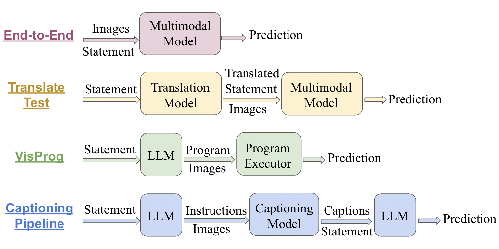

# Multilingual Visual Reasoning

This repo includes the implementations described in the paper "*What Is Missing in Multilingual Visual Reasoning and How to Fix It*". 

## Brief Overview

In this work, we explore various models, including GPT-4V, LLaVA, mBLIP, CCLM, and UNITERs on NLVR2 and MaRVL. NLVR2 and MaRVL involves the same task of reasoning whether a natural language statement is true based on a pair of images. An example is shown below.

 

Analyzing the failures of these models, we find that multilinguality, complex reasoning, and multimodality are three key aspects that make this task so challenging to models. Based on our analysis, we explore and propose three interventions to address these three challenges: translation, visual programming, and reasoning with captions. Our interventions achieve the best open performance on this task in a zero-shot setting, boosting open model LLaVA's performance by 13.4%, while also minorly improving GPT-4V's performance.

## Repo Setup

1. Clone this repo.

2. Create a new Conda Environment to manage all packages.

```bash
conda create -n mvr python=3.10 -y
conda activate mvr
pip install --upgrade pip
pip install -r requirements.txt
```

## Experiments

### Evaluation

#### Zero-Shot

#### Finetuned

We use NLVR2's train split to finetune the models, and then evaluate on MaRVL and NLVR2 dev split.

UNITERs: We evaluate xUNITER and mUNITER, and instructions on how to reproduce the results are provided in `uniters/READEME.md`.

### Interventions

 

#### Translate Test

#### VisProg

#### Reasoning with Captions

### Zeno Result Visualization

We upload all our experimental results to [Zeno](https://zenoml.com/), a platform which we use to visualize our results. An example visualization is shown below.

 

Note: Our paper is under anonymous review. Since the links to zeno is unanonymized, we will post the links to zeno post-review. 

### TODO

Our paper is under anonymous review. We will post the citation to our paper post-review. 
